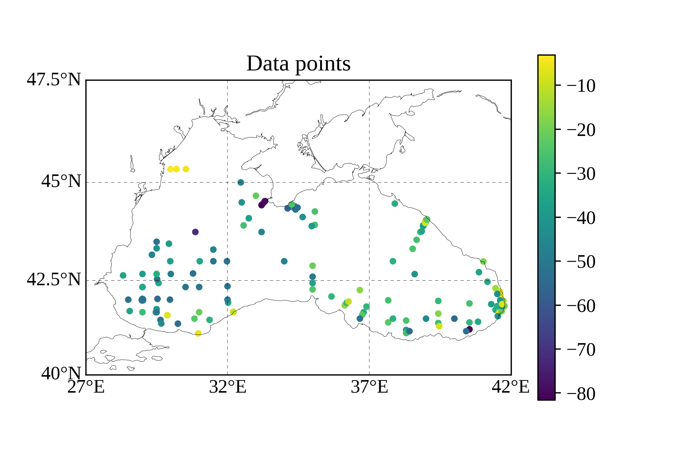
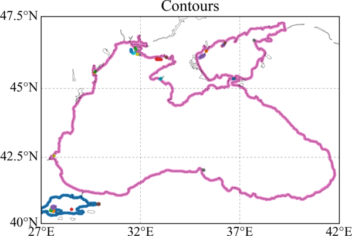
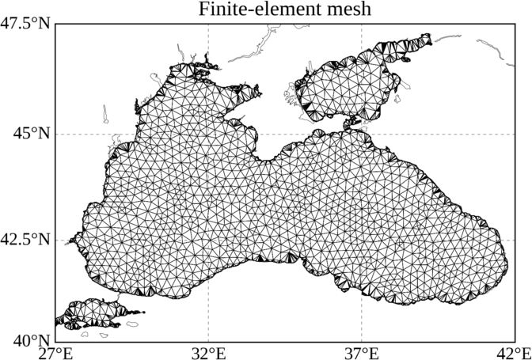
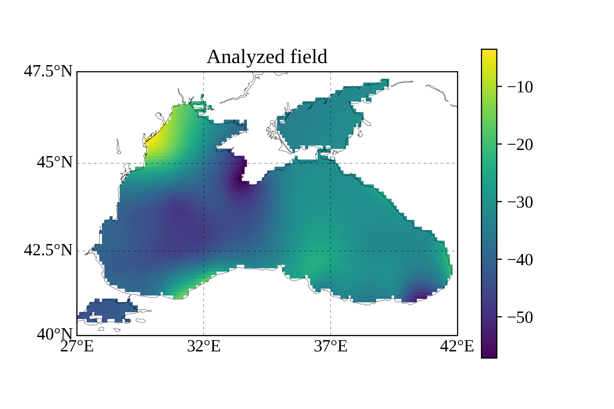
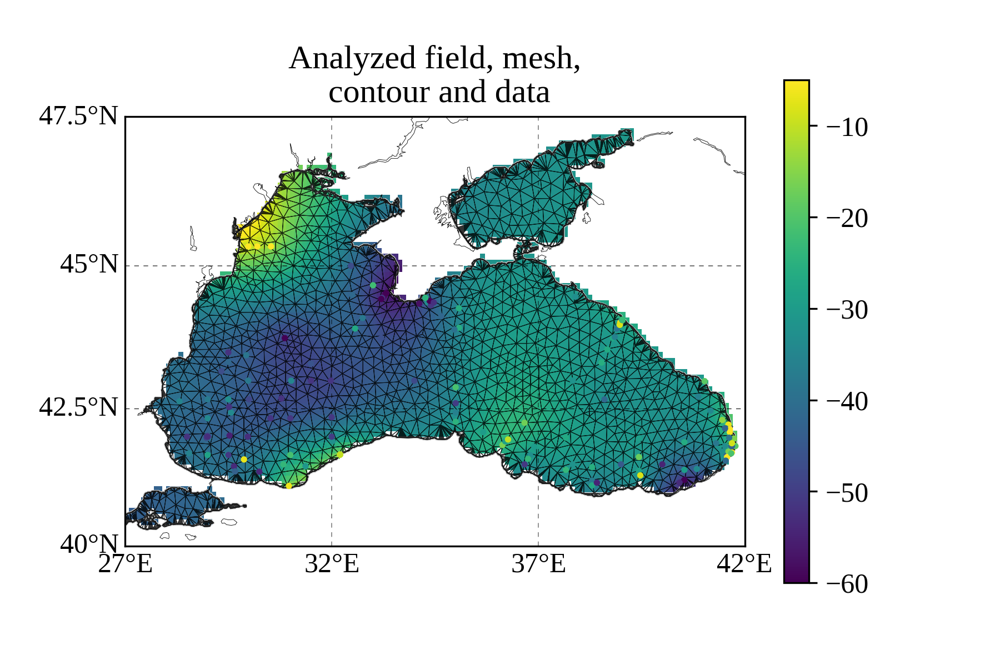

[](https://zenodo.org/badge/latestdoi/44103456)

# Diva Python Tools

A set of python modules to help users with
1. the preparation of the Diva input files: data, contours, parameters;
2. the execution of the Diva interpolation tool,
3. the reading of output files (analysis, finite-element mesh),
4. the input and output plotting.

## Getting started 

### Prerequisites

The [Diva](https://github.com/gher-ulg/diva) interpolation tool has to be installed and compiled on your machine. See the related [documentation](https://github.com/gher-ulg/DIVA/blob/master/README.md#installing) for the installation.

### Installing

Clone the package:
```bash
git clone git@github.com:gher-ulg/DivaPythonTools.git
```
or download the latest stable [release](https://github.com/gher-ulg/DivaPythonTools/releases).

Inside DivaPythonTools directory execute:
```python
pip install -r requirements.txt
python setup.py install
```

After this you should use it as:
```python
from pydiva import pydiva2d, pydiva4d
```

## Module description

The main modules are [`pydiva2d`](./pydiva2d.py) and [`pydiva4d`](./pydiva4D.py), which define the classes for the 2D and 4D version of Diva, respectively.

### pydiva2d

The module defines classes corresponding to the main Diva input (data, parameters, contours) and output files (analysed and error fields, finite-element mesh).

### pydiva4d

The module defines classes to run the 4D version of Diva.

## Plots

The figures can be generated with and without the [Basemap](https://github.com/matplotlib/basemap) module (Plot on map projections). 

Some examples obtained with mixed-layer depth (MLD) data are shown below. The complete example to generate these plots is inside the Notebooks directory [(run_diva2D_MLD)](./Notebooks/run_diva2D_MLD.ipynb).

The [Notebooks](./Notebooks) directory contains additional examples showing how to run 2D and 4D cases.

### Data values
Scatter plot showing the data positions and values.    


### Contours
By default, each sub-contour is displayed in a different color.     


### Finite-element mesh
Triangular mesh covering the region of interest.     


### Analysed fields
Pseudo-color plot of the gridded field obtained by the interpolation.     


### Combined information
Data, contours, mesh and analysis on the same figure.     


## Acknowledgments

[Diva](https://github.com/gher-ulg/DIVA) developments have benefited from the users' feedback and numerous comments, especially during the editions of the Diva workshops.

The present module was initiated in the frame of [SeaDataCloud](SeaDataCloud) project.  


